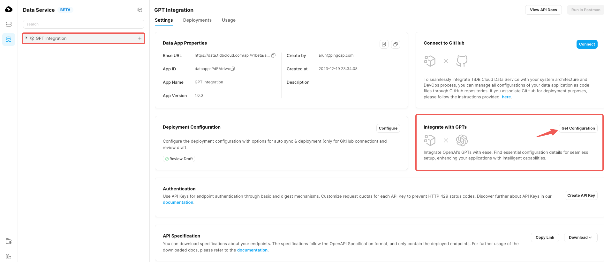
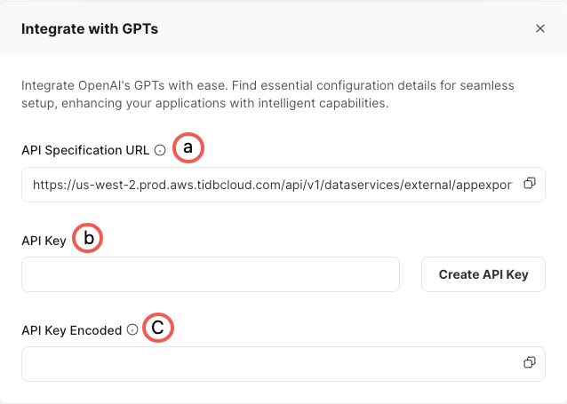

# Manage a Data App

A Data App in Data Service (beta) is a collection of endpoints that you can use to access data for a specific application. You can configure authorization settings using API keys to restrict access to endpoints in a Data App.

This document describes how to manage your Data Apps in the TiDB Cloud console. On the [**Data Service**](https://tidbcloud.com/console/data-service) page, you can manage all Data Apps, endpoints, and API keys.

## Create a Data App

To create a Data App for your project, perform the following steps:

1. On the [**Data Service**](https://tidbcloud.com/console/data-service) page of your project, click <MDSvgIcon name="icon-create-data-app" /> **Create DataApp** in the left pane.

    > **Tip:**
    >
    > If this is the first Data App in your project, click **Create Data App** in the middle of the page.

2. Enter a name, a description, and select clusters that you want the Data App to access.

    > **Note:**
    >
    > By default, the Data App type is **Standard Data App**. If you want to create a **Chat2Query Data App**, refer to [Get Started with Chat2Query API](/tidb-cloud/use-chat2query-api.md) instead of this document.

3. (Optional) To automatically deploy endpoints of the Data App to your preferred GitHub repository and branch, enable **Connect to GitHub**, and then do the following:

    1. Click **Install on GitHub**, and then follow the on-screen instructions to install **TiDB Cloud Data Service** as an application on your target repository.
    2. Click **Authorize** to authorize access to the application on GitHub.
    3. Specify the target repository, branch, and directory where you want to save the configuration files of your Data App.

        > **Note:**
        >
        > - The directory must start with a slash (`/`). For example, `/mydata`. If the directory you specified does not exist in the target repository and branch, it will be created automatically.
        > - The combination of repository, branch, and directory identifies the path of the configuration files, which must be unique among Data Apps. If your specified path is already used by another Data App, you need to specify a new path instead. Otherwise, the endpoints configured in the TiDB Cloud console for the current Data App will overwrite the files in your specified path.
        > - If your specified path contains configuration files copied from another Data App and you want to import these files to the current Data App, see [Import configurations of an existing Data App](/tidb-cloud/data-service-manage-github-connection.md#import-configurations-of-an-existing-data-app).

4. Click **Create Data App**.

    The newly created Data App is added to the top of the list. A default `untitled endpoint` is created for the new Data App.

5. If you have configured to connect your Data App to GitHub, check your specified GitHub directory. You will find that the [Data App configuration files](/tidb-cloud/data-service-app-config-files.md) have been committed to the directory by `tidb-cloud-data-service`, which means that your Data App is connected to GitHub successfully.

    For your new Data App, **Auto Sync & Deployment** and **Review Draft** are enabled by default so you can easily synchronize Data App changes between TiDB Cloud console and GitHub and review changes before the deployment. For more information about the GitHub integration, see [Deploy your Data App changes with GitHub automatically](/tidb-cloud/data-service-manage-github-connection.md).

## Configure a Data App

You can edit the name, version, or description of a Data App, and manage its GitHub connection, linked data sources, API keys, endpoints, and deployments.

### Edit Data App properties

You can edit the name, version, and description of a Data App. To edit Data App properties, perform the following steps:

1. Navigate to the [**Data Service**](https://tidbcloud.com/console/data-service) page of your project.
2. In the left pane, click the name of your target Data App to view its details.
3. In the **Data App Properties** area, click <svg width="16" height="16" viewBox="0 0 24 24" fill="none" xmlns="http://www.w3.org/2000/svg" color="gray.1"><path d="M11 3.99998H6.8C5.11984 3.99998 4.27976 3.99998 3.63803 4.32696C3.07354 4.61458 2.6146 5.07353 2.32698 5.63801C2 6.27975 2 7.11983 2 8.79998V17.2C2 18.8801 2 19.7202 2.32698 20.362C2.6146 20.9264 3.07354 21.3854 3.63803 21.673C4.27976 22 5.11984 22 6.8 22H15.2C16.8802 22 17.7202 22 18.362 21.673C18.9265 21.3854 19.3854 20.9264 19.673 20.362C20 19.7202 20 18.8801 20 17.2V13M7.99997 16H9.67452C10.1637 16 10.4083 16 10.6385 15.9447C10.8425 15.8957 11.0376 15.8149 11.2166 15.7053C11.4184 15.5816 11.5914 15.4086 11.9373 15.0627L21.5 5.49998C22.3284 4.67156 22.3284 3.32841 21.5 2.49998C20.6716 1.67156 19.3284 1.67155 18.5 2.49998L8.93723 12.0627C8.59133 12.4086 8.41838 12.5816 8.29469 12.7834C8.18504 12.9624 8.10423 13.1574 8.05523 13.3615C7.99997 13.5917 7.99997 13.8363 7.99997 14.3255V16Z" stroke="currentColor" stroke-width="2" stroke-linecap="round" stroke-linejoin="round"></path></svg>, modify the App name, version, or description, and then click **Confirm**.

### Manage GitHub connection

For more information, see [Deploy automatically with GitHub](/tidb-cloud/data-service-manage-github-connection.md).

### Integrate your Data App with GPTs

You can integrate your Data App with [GPTs](https://openai.com/blog/introducing-gpts) to enhance your applications with intelligent capabilities.

To integrate your Data App with GPTs, perform the following steps:

1. Navigate to the [**Data Service**](https://tidbcloud.com/console/data-service) page of your project.
2. In the left pane, locate your target Data App and click the name of your target Data App to view its details.
3. In the **Integration with GPTs** area, click **Get Configuration**.

4. In the displayed dialog box, you can see the following fields:

    a. **API Specification URL**: copy the URL of the OpenAPI Specification of your Data App. For more information, see [Use the OpenAPI Specification](#use-the-openapi-specification).
    b. **API Key**: enter the API key of your Data App. If you do not have an API key yet, click **Create API Key** to create one. For more information, see [Create an API key](/tidb-cloud/data-service-api-key.md#create-an-api-key).
    c. **API Key Encoded**: copy the base64 encoded string equivalent to the API key you have provided.
    

6. Use the copied API Specification URL and the encoded API key in your GPT configuration.

### Manage linked data sources

You can add or remove linked clusters for a Data App.

To link a cluster to a Data App, perform the following steps:

1. Navigate to the [**Data Service**](https://tidbcloud.com/console/data-service) page of your project.
2. In the left pane, locate your target Data App and click the name of your target Data App to view its details.
3. In the **Linked Data Sources** area, click **Add Cluster**.
4. In the displayed dialog box, select a cluster from the list and click **Add**.

To remove a linked cluster from a Data App, perform the following steps:

1. Navigate to the [**Data Service**](https://tidbcloud.com/console/data-service) page of your project.
2. In the left pane, locate your target Data App and click the name of your target Data App to view its details.
3. In the **Linked Data Sources** area, locate the target linked cluster you want to remove from the Data App, and click **Delete** in the **Action** column.
4. In the displayed dialog box, confirm the removal.

    After you remove a linked cluster, the cluster is not deleted, but the existing endpoints in the Data App cannot access it.

### Manage an API key

For more information, see [Manage an API key](/tidb-cloud/data-service-api-key.md).

### Manage an endpoint

For more information, see [Manage an endpoint](/tidb-cloud/data-service-manage-endpoint.md).

### Manage deployments

To manage deployments, perform the following steps:

1. Navigate to the [**Data Service**](https://tidbcloud.com/console/data-service) page of your project.
2. In the left pane, locate your target Data App and click the name of your target Data App to view its details.
3. In the **Deployment Configuration** area, click **Config**. The dialog for deployment configuration is displayed.
4. In the dialog, choose your desired setting of **Auto Sync & Deployment** and **Review Draft**.

    - **Auto Sync & Deployment**

        - This option can be enabled only when your Data App is connected to GitHub. For more information, see [Deploy automatically with GitHub](/tidb-cloud/data-service-manage-github-connection.md).
        - When it is enabled, the changes made in your specified GitHub directory can be automatically deployed in TiDB Cloud, and the changes made in the TiDB Cloud console can be pushed to GitHub as well. You can find the corresponding deployment and commit information in the Data App deployment history.
        - When it is disabled, the changes made in your specified GitHub directory will **NOT** be deployed in TiDB Cloud, and the changes made in the TiDB Cloud console will **NOT** be pushed to GitHub either.

    - **Review Draft**

        - When it is enabled, you can review the Data App changes you made in the TiDB Cloud console before the deployment. Based on the review, you can either deploy or discard the changes.
        - When it is disabled, the Data App changes you made in the TiDB Cloud console are deployed directly.

5. In the **Action** column, you can edit or re-deploy your changes according to your needs.

## Use the OpenAPI Specification

Data Service (beta) supports generating the OpenAPI Specification 3.0 for each Data App, which enables you to interact with your endpoints in a standardized format. You can use this specification to generate standardized OpenAPI documentation, client SDKs, and server stubs.

### Download the OpenAPI Specification

To download the OpenAPI Specification in JSON or YAML format for a Data App, perform the following steps:

1. Navigate to the [**Data Service**](https://tidbcloud.com/console/data-service) page of your project.
2. In the left pane, click the name of your target Data App to view its details.
3. In the **API Specification** area, click **Download** and select **JSON** or **YAML**.

    If this is your first time downloading the OpenAPI Specification, you need to authorize the request when prompted.

4. Then, the OpenAPI Specification is downloaded to your local machine.

### View the OpenAPI documentation

Data Service (beta) provides autogenerated OpenAPI documentation for each Data App. In the documentation, you can view the endpoints, parameters, and responses, and try out the endpoints.

To access the OpenAPI documentation, perform the following steps:

1. Navigate to the [**Data Service**](https://tidbcloud.com/console/data-service) page of your project.
2. In the left pane, click the name of your target Data App to view its details.
3. In the upper-right corner of the page, click **View API Docs**.

    If this is your first time using the OpenAPI Specification, you need to authorize the request when prompted.

4. Then, the OpenAPI documentation is opened in a new tab. In the documentation, you can view the following information:

    - Data App name, version, and description.
    - Endpoints grouped by tags.

5. (Optional) To try out an endpoint, take the following steps:

    1. Click **Authorize** and enter your Data App public key as **Username** and private key as **Password** in the displayed dialog box.

        For more information, see [Manage an API key](/tidb-cloud/data-service-api-key.md).

    2. Locate your target endpoint, provide the required parameters, and then click **Try it out**. You can view the response in the **Response body** area.

  For more information about how to use the OpenAPI documentation, see [Swagger UI](https://swagger.io/tools/swagger-ui/).

## Delete a Data App

> **Note:**
>
> Before you delete a Data App, make sure that all endpoints are not online. Otherwise, you cannot delete the Data App. To undeploy an endpoint, refer to [Undeploy an endpoint](/tidb-cloud/data-service-manage-endpoint.md#undeploy-an-endpoint).

To delete a Data App, perform the following steps:

1. Navigate to the [**Data Service**](https://tidbcloud.com/console/data-service) page of your project.
2. In the left pane, locate your target Data App and click the name of your target Data App to view its details.
3. In the **Danger Zone** area, click **Delete Data App**. A dialog box for confirmation is displayed.
4. Type your `<organization name>/<project name>/<data app name>`, and then click **I understand, delete**.

    Once a Data App is deleted, the existing endpoints and API keys in the Data App are also deleted. If this Data App is connected to GitHub, deleting the App does not delete the files in the corresponding GitHub repository.

## Learn more

- [Run Data App in Postman](/tidb-cloud/data-service-postman-integration.md)
